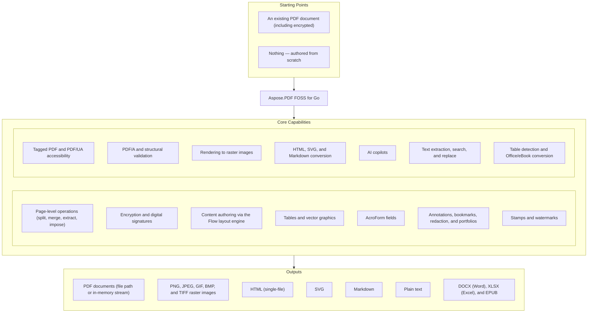

# Aspose.PDF FOSS for Go

[](https://github.com/aspose-pdf-foss/aspose-pdf-foss-for-go/actions/workflows/test.yml) [](https://github.com/aspose-pdf-foss/aspose-pdf-foss-for-go/actions/workflows/lint.yml) [](https://pkg.go.dev/github.com/aspose-pdf-foss/aspose-pdf-foss-for-go) [](https://opensource.org/licenses/MIT) [](https://go.dev/dl/)

[](https://products.aspose.org/pdf/go/)

A pure Go PDF library — no CGo, no native libraries, no third-party package dependencies
(standard library only), MIT-licensed. It creates, edits, renders, signs, encrypts, converts, and
validates PDF documents: split/merge/extract pages, extract and search text, fill and build
AcroForms, draw text/vector graphics/tables, embed and subset fonts, apply digital signatures
(PKCS#7, PAdES, timestamps), validate and convert PDF/A, author accessible Tagged PDF, and
render pages to images with a built-in rasterizer that has no third-party package dependencies of
its own, convert to and from Markdown, HTML, and SVG, and query documents through a set of AI
copilots over any OpenAI-compatible endpoint.

The API shape mirrors Aspose.PDF for .NET where natural, so concepts transfer directly for
developers coming from that library, and spec references throughout follow ISO 32000-1 (PDF 1.7)
and ISO 32000-2 (PDF 2.0). This project is not to be confused with `aspose-pdf-go-cpp` (a CGo
wrapper around a native library) — it is 100% Go source, `go get` and cross-compile anywhere.

## Navigation

- [At a Glance](#at-a-glance)
- [Key Capabilities](#key-capabilities)
- [Installation](#installation)
- [Dependencies](#dependencies)
- [Quick Start](#quick-start)
- [Feature Showcase](#feature-showcase)
- [Additional Examples](#additional-examples)
- [API Reference](#api-reference)
- [Documentation & Resources](#documentation--resources)
- [Scope and Limitations](#scope-and-limitations)
- [Development and Testing](#development-and-testing)
- [Third-Party Notices](#third-party-notices)
- [License](#license)

## At a Glance



## Key Capabilities

- **Page-level operations and metadata** — `Document.Split()` breaks a document into per-page
  documents; `Extract` builds a new document from selected `PageRange`s without touching the
  source; `Append` combines multiple PDFs into one by merging another document's pages in place;
  `Rotate`/`SetRotation` turn pages, and `Reorder` rearranges them by an explicit 1-based index
  slice (repeats and omissions both allowed); `Document.NUp`/`Document.Booklet` (`NUp`/`Booklet`)
  impose pages onto larger sheets for N-up printing or saddle-stitch binding, each returning a new
  document built from Form XObjects and leaving the source untouched; and blank PDFs can be
  created from scratch with `NewDocument`/`NewDocumentFromFormat`. Each `*Page` exposes its own
  `Number()`, `Size()` (a `PageSize{Width, Height}` in points), and `Rotation()` getters, and page
  geometry (`MediaBox`/`CropBox`/`TrimBox`/`BleedBox`/`ArtBox`) is readable and, via
  `SetMediaBox`/`SetCropBox`/`SetTrimBox`/`SetBleedBox`/`SetArtBox` (plus the `SetPageSize`
  shorthand for resizing the MediaBox), writable without scaling existing content; the `/Info`
  dictionary round-trips through `Document.Info()`/`SetInfo()`/`ClearInfo()` and a `DocumentInfo`
  struct, distinct from the XMP metadata packet available via
  `Document.XMP()`/`SetXMP()`/`ClearXMP()` (backed by the `/Catalog/Metadata` stream, with a raw
  `XMPRaw()`/`SetXMPRaw()` escape hatch and `SyncInfoToXMP()` to mirror `/Info` into XMP); and the
  `/PageLabels` numbering tree is written with `Document.SetPageLabels` (roman/decimal/alphabetic
  styles, prefix, and start value per range) and read back per-page via `Page.Label()`.
- **Encryption and digital signatures** — `Document.SetPassword(userPassword, ownerPassword)`
  password-protects the document on save with AES-128 (`/CFM /AESV2`), AES-256 (`/CFM /AESV3`,
  bumps the file to PDF 2.0), or RC4-128 and granular viewer permissions (print, copy, modify,
  annotate, fill, accessibility, assemble); sign with a PKCS#7-detached signature
  (SHA-256, RSA or ECDSA) that can be PAdES, a DocMDP certification, and/or carry an RFC 3161
  trusted timestamp, over plain or already-encrypted documents, with support for multiple
  incremental signatures and verification via `VerifySignatures` — optionally asking the issuer
  whether the signing certificate was revoked (OCSP or CRL, network opt-in through
  `ValidationOptions`) and embedding that evidence as a `/DSS` with `AddValidationInfo`, so the
  signature still verifies after the certificate expires (LTV). Keys are passed as a standard
  `crypto.Signer` plus `*x509.Certificate` — no `.p12` file required. Documents can also be
  encrypted for **certificate recipients** instead of a password
  (`EncryptionOptions.Recipients`, the `/Adobe.PubSec` handler): each recipient gets its own
  permissions, and the file opens with `OpenWithCertificate(path, cert, key)` for any
  `crypto.Decrypter`.
- **Content authoring with the Flow layout engine** — `Document.NewFlow` lays out paragraphs,
  headings, images, tables, and lists top-to-bottom with automatic pagination; floating boxes
  (absolute, in-flow, or floated with text wrap-around) and multi-column layout are built on the
  same engine; `FlowOptions.Tagged` auto-tags every element for a one-call PDF/UA-conformant
  document.
- **Tables and vector graphics** — `pdf.NewTable()` builds multi-page tables with repeating
  header rows (auto-fit or explicit `Row.SetHeight`), cell merging via
  `Cell.SetColSpan`/`SetRowSpan`, per-cell styling, and image cells via `Cell.SetImage`, rendered
  onto a page with `(*Page).AddTable(t, rect)`; `(*Page).DrawLine`/`DrawRectangle`/`DrawCircle`/
  `DrawPath` and friends draw first-class vector content directly on a page, and a `Path` fluent
  builder (`MoveTo`/`LineTo`/`CurveTo`/`QuadTo`/`Arc`/`Close`) covers arbitrary shapes; fills
  support solid colours, `ShapeStyle.FillGradient` (linear or radial), and
  `Document.CreateTilingPattern(w, h)` repeating-motif tiling patterns.
- **AcroForms** — read, and build from scratch every standard field type with
  `AddTextField`/`AddCheckbox`/`AddRadioGroup`/`AddComboBox`/`AddListBox`/`AddPushButton` (plus
  the typed password/file-select/rich-text/number/date variants — behavior flags exposed as `/Ff`
  on the underlying field dictionary) and remove one with `RemoveField`; `AddBarcodeField` draws
  Code128 or QR symbols in place of text, encoded by this library's own pure-Go encoders (no
  external dependency); `Field.SetStyle`/`Style()` control widget appearance (border, background, font),
  and `(*ButtonField).SetAppearance` gives push buttons distinct normal/rollover/down captions
  and an icon; field values round-trip as typed JSON, FDF, and XFDF for template-fill and
  Acrobat-interoperable data interchange.
- **Annotations, bookmarks, and redaction** — the full ISO 32000-1 markup/drawing annotation
  family with auto-regenerated appearance streams, hierarchical outlines (`OutlineItemCollection`)
  and named destinations with all 8 PDF destination types, and mark-then-apply redaction that
  irreversibly removes text, images, and paths from the marked regions. `Document.Flatten()`/
  `Form.Flatten()` bake interactive fields and annotations into static page content so the
  result renders identically but is no longer editable.
- **Attachments and portfolios** — `Document.EmbeddedFiles()` attaches, reads back, and removes
  document-level files through the `/Catalog/Names/EmbeddedFiles` name tree, while
  `Document.Collection()` turns those attachments into a **PDF portfolio**: a schema of custom
  columns (`Schema().Add("Amount", "Total", CollectionFieldNumber)`), per-file values via
  `EmbeddedFile.CollectionItem()`, an initial file, a sort order, and a details/tiles/hidden
  presentation mode — so viewers show a navigable table instead of a plain attachment list, and
  the cover page still opens anywhere.
- **Tagged PDF and PDF/UA accessibility** — `Document.TaggedContent()` builds a logical structure
  tree as content is drawn (`TagContent`, `AddTaggedTable`, `AddTaggedList`), and
  `Document.ValidatePDFUA()` reports the PDF/UA-1 prerequisites still missing.
- **PDF/A and structural validation** — `Validate` checks structural integrity;
  `ValidatePDFA(PDFA1B/2B/3B/1A/2A/3A)` reports archival-conformance violations; `ConvertToPDFA`
  moves a document toward conformance in one call (strips encryption/JavaScript, embeds
  non-embedded Standard-14 fonts, adds an sRGB ICC OutputIntent, writes the `pdfaid` XMP packet).
- **E-invoices (ZUGFeRD / Factur-X)** — `Document.AttachInvoice(xml)` turns a document into a hybrid
  e-invoice: the CII XML is embedded as `factur-x.xml` with the associated-file relationship its
  profile calls for, the Factur-X metadata and extension schema are written, and the document is
  converted to PDF/A-3. `Document.Invoice()` extracts the invoice from incoming Factur-X and ZUGFeRD
  2.x/1.0 files together with its profile. Attachments also gain PDF/A-3 associated-file
  relationships (`EmbeddedFile.SetAFRelationship`).
- **Rendering to raster images** — a pure-Go anti-aliased renderer with no third-party package
  dependencies of its own (its own rasterizer — no `golang.org/x/image`, no cgo) draws vector
  graphics, images (including CCITT fax, JBIG2, and JPEG2000 (`/JPXDecode`) scans), and text
  (embedded and non-embedded via a `FontRepository` covering `.ttc`/`.otf` faces, including
  non-embedded CJK) to PNG, JPEG, GIF, BMP, and single- or multi-page
  TIFF via `Page.RenderImage`/`RenderPNG`/`RenderTIFF`/… and `Document.RenderTIFF`.
- **HTML, SVG, and Markdown conversion** — `SaveHTML` exports a single-file HTML document with no
  external assets in four modes (faithful raster, visible text, native SVG-per-page, and
  reflowable), including fillable AcroForm controls; in text/native modes, embedded TrueType/
  OpenType fonts are re-wrapped as WOFF `@font-face` data URLs with a browser cmap synthesized
  from the font's `/ToUnicode` mapping, so text renders in the document's real faces. `SaveSVG`
  exports standalone true-vector SVG pages with all binary parts embedded as `data:` URLs by
  default, or externalized via `ResourceWriter`, and `AddSVG` imports SVG 1.1 content (shapes,
  gradients, clipping, masks) back onto a page; `MarkdownToDocument` renders CommonMark + GFM as a
  paginated PDF (652/652 on the official test suite), `Flow.AddMarkdown` mixes Markdown into a
  Flow document, `Page.AddMarkdown(md, rect)` draws it into a `Rectangle` on an existing page, and
  `SaveMarkdown` re-assembles a PDF as GFM Markdown.
- **Stamps and watermarks** — `Document.AddTextWatermark`/`AddSVGWatermark` overlay a text or SVG
  watermark across selected pages (or every page); `(*Page).AddStamp`/`(*Document).AddStamp` place
  a `TextStamp`, `ImageStamp`, or `PageNumberStamp` on one or more pages.
- **Table detection and Office/eBook conversion** — `TableAbsorber` (`Visit(page)` then
  `TableList()`) recognizes ruled and borderless tables directly from a page's vector geometry (no
  rasterization), with conservative guards so ordinary prose, lists, TOCs, and code listings are
  never mistaken for tables. This feeds `Document.SaveDocx`/`WriteDocx` (a pure-stdlib OOXML
  writer producing styled runs, heading styles, hyperlinks, and lists, plus real Word tables —
  `EnhancedFlow`, the default mode — from detected table structure), `Document.SaveXlsx`/
  `WriteXlsx` (detected tables become Excel worksheets with real numeric cells, merged cells, and
  header shading, or a full-page cell-per-line mode), and `Document.SaveEpub`/`WriteEpub` (a
  reflowable, spec-correct OCF-container EPUB 3 book with chapters split at headings and a real
  navigation TOC).
- **Document comparison** — `CompareDocumentsPageByPage` and `CompareFlatDocuments` report what
  changed between two PDFs word by word, with the page and rectangle of every difference;
  `ComparisonResult.SaveMarkup` writes a copy of either document in which insertions are
  highlighted, deletions struck out and removed text kept in the annotation note, so a reviewer
  reads the change list in any PDF viewer. Mirrors Aspose.PDF for .NET's `TextPdfComparer`.
- **AI copilots** — the `ai` subpackage adds document summarization (`SummaryCopilot`), OCR of
  scanned pages with a `MakeSearchable` pipeline that writes recognized text back as an invisible,
  selectable layer, document Q&A with conversation history (`ChatCopilot`), and automatic
  `/Alt` text generation for tagged figures (`ImageDescriptionCopilot`), over any
  OpenAI-compatible endpoint.
- **Text extraction, fonts, and optimization** — extract text in visual or raw reading order
  (`TextExtractOptions{Mode: TextExtractRaw}`) with full layout info, recover paragraph/column
  structure (`Paragraphs()`), search and replace text in place, embed and subset TrueType/
  OpenType fonts (`.ttf`/`.otf`/`.ttc`) — `Document.LoadFont`/`Document.LoadFontByName("Calibri",
  bold, italic)` resolve faces by family name via a pluggable `FontRepository`, and
  `Document.SubsetFonts()` rebuilds each embedded font's own glyph tables (`glyf`/`loca`/`hmtx`/
  `CIDToGIDMap`) down to only the glyphs actually used; custom glyphs can also be authored
  outright with `Document.CreateType3Font()` — `Type3Font.AddGlyph(rune, width)` hands back a
  drawing canvas in glyph space, so a symbol drawn with the vector API becomes a real font
  character whose text still extracts and searches (an embedded `ToUnicode` CMap carries the
  mapping); `Document.RemoveUnusedObjects()` deletes
  every object that neither a page nor the document catalog uses (metadata, bookmarks,
  attachments and the structure tree are kept) and returns the removed count on its own, or fold that
  same cleanup into a larger pass with the unified `Document.Optimize` pass
  (`DefaultOptimizationOptions()` is the safe, lossless preset — remove unused objects, subset
  fonts, Flate-compress and dedupe streams, pack objects into object streams; opt into lossy image recompression via
  `OptimizationOptions.Images`) or the image-only `Document.OptimizeImages(OptimizeImageOptions)`
  pass (max DPI downscaling, JPEG quality, and PNG→JPEG conversion); reduce file size further with
  `Document.SaveLinearized`/`WriteToLinearized` (linearized/fast-web-view output per ISO 32000-1
  Annex F, so viewers can render page 1 before the whole file downloads), or `ConvertToGrayscale`.

## Installation

```bash
go get github.com/aspose-pdf-foss/aspose-pdf-foss-for-go
```

Requires Go 1.24 or newer. The module has no transitive dependencies — everything is built on
the Go standard library, including the PDF parser/writer, the raster renderer, the SVG and
Markdown engines, and the PKCS#7/CMS signing code.

## Dependencies

### Required Package Dependencies

No required third-party package dependencies.

### Native and System Requirements

- Go 1.24 or later (`go.mod`'s own `go 1.24` directive).

## Quick Start

```go
package main

import (
	"fmt"
	"log"

	pdf "github.com/aspose-pdf-foss/aspose-pdf-foss-for-go"
)

func main() {
	// Open a PDF and split it into per-page documents.
	doc, err := pdf.Open("input.pdf")
	if err != nil {
		log.Fatal(err)
	}
	pages, err := doc.Split()
	if err != nil {
		log.Fatal(err)
	}
	for i, p := range pages {
		p.Save(fmt.Sprintf("page%03d.pdf", i+1))
	}

	// Merge two PDFs into one — Append mutates the receiver in place.
	a, _ := pdf.Open("file1.pdf")
	b, _ := pdf.Open("file2.pdf")
	a.Append(b)
	fmt.Println("merged:", a.PageCount(), "pages")
	a.Save("merged.pdf")
}
```

See [`_examples/`](_examples/) for full runnable programs covering text, forms, annotations,
tables, vector graphics, SVG, and the end-to-end `feature_showcase` demo, or short focused API
snippets under "Examples" on [pkg.go.dev](https://pkg.go.dev/github.com/aspose-pdf-foss/aspose-pdf-foss-for-go).

## Feature Showcase

[](docs/feature_showcase.pdf)

[**docs/feature_showcase.pdf**](docs/feature_showcase.pdf) is a single 14-page PDF generated by
[`_examples/feature_showcase`](_examples/feature_showcase/main.go) that walks nearly every
capability above in one document — a clickable table of contents (built with `Page.AddTOC`),
styled AcroForm fields, the full
annotation gallery, redactions, multi-page tables, vector graphics, and a meta "Rendering & Imposition"
page whose thumbnails are renders of the document itself, produced by this library's own renderer.
Cross-cutting metadata — bookmarks, named destinations, page labels, and Info + XMP
metadata — is set once and carried through the whole document. The showcase itself is
deliberately left unencrypted so it previews inline on GitHub and opens in every viewer;
encryption (RC4 / AES-128 / AES-256) is covered in
[Encryption and Signing](#encryption-and-signing) below. Regenerate it locally with
`go run ./_examples/feature_showcase`.

## Additional Examples

The most representative example beyond Quick Start is building a document from scratch with the
Flow layout engine — an additive layer over the Rectangle-based drawing API that computes the
rectangles for you — rather than editing an existing one.

### Content Authoring With the Flow Layout Engine

```go
doc := pdf.NewDocumentFromFormat(pdf.PageFormatA4)
flow := doc.NewFlow(pdf.FlowOptions{})
flow.AddHeading(1, "Quarterly Report", pdf.TextStyle{})
flow.AddParagraph("Revenue grew in every region this quarter.", pdf.TextStyle{Size: 11})
flow.AddList([]string{"North: +12%", "South: +8%"}, false, pdf.TextStyle{Size: 11})

pages, err := flow.Render()
if err != nil {
	log.Fatal(err)
}
fmt.Println("pages:", pages)
```

`NewFlow` returns a `*Flow` that lays chained `AddParagraph`/`AddHeading`/`AddImage`/`AddTable`/
`AddList` calls out top-to-bottom, paginating automatically; `Render()` returns the number of
pages produced. `FlowOptions.Tagged` auto-tags every element for a one-call PDF/UA-conformant
document.

<details>
<summary>View Additional Code Examples</summary>

### Encrypt a Document

```go
doc := pdf.NewDocumentFromFormat(pdf.PageFormatA4)
doc.SetEncryption(pdf.EncryptionOptions{
	UserPassword:  "secret",
	OwnerPassword: "owner-secret",
	Permissions:   &pdf.Permissions{AllowPrint: true, AllowCopy: true},
	Algorithm:     pdf.EncryptionAlgAES128,
})

var buf bytes.Buffer
if _, err := doc.WriteTo(&buf); err != nil {
	log.Fatal(err)
}

// The file is now encrypted; Open returns ErrEncrypted.
if _, err := pdf.OpenStream(&buf); err != nil {
	fmt.Println("encrypted")
}
```

### Digitally Sign and Verify

```go
key, _ := ecdsa.GenerateKey(elliptic.P256(), cryptorand.Reader)
tmpl := &x509.Certificate{
	SerialNumber: big.NewInt(1),
	Subject:      pkix.Name{CommonName: "Jane Signer"},
	NotBefore:    time.Now().Add(-time.Hour),
	NotAfter:     time.Now().Add(24 * time.Hour),
	KeyUsage:     x509.KeyUsageDigitalSignature,
}
der, _ := x509.CreateCertificate(cryptorand.Reader, tmpl, tmpl, &key.PublicKey, key)
cert, _ := x509.ParseCertificate(der)

doc := pdf.NewDocumentFromFormat(pdf.PageFormatA4)
if err := doc.Sign(pdf.SignOptions{Certificate: cert, PrivateKey: key, Reason: "Approval"}); err != nil {
	log.Fatal(err)
}
var buf bytes.Buffer
if _, err := doc.WriteTo(&buf); err != nil {
	log.Fatal(err)
}

signed, _ := pdf.OpenStream(&buf)
sigs, err := signed.VerifySignatures()
if err != nil {
	log.Fatal(err)
}
fmt.Printf("signatures: %d, valid: %v, reason: %s\n", len(sigs), sigs[0].Valid, sigs[0].Reason)
```

### Build a Table

```go
doc := pdf.NewDocument(595, 842)
page, _ := doc.Page(1)

table := pdf.NewTable().
    SetColumnWidths([]float64{120, 200, 80}).
    SetBorder(pdf.BorderInfo{Sides: pdf.BorderSideAll, Width: 1}).
    SetDefaultCellBorder(pdf.BorderInfo{Sides: pdf.BorderSideAll, Width: 0.5}).
    SetDefaultCellMargin(pdf.MarginInfo{Top: 4, Right: 6, Bottom: 4, Left: 6}).
    SetDefaultCellStyle(pdf.TextStyle{Font: pdf.FontHelvetica, Size: 10})

header := table.AddRow()
header.AddCells("Name", "Description", "Qty")
for _, c := range header.Cells() {
    c.SetBackground(&pdf.Color{R: 0.9, G: 0.9, B: 0.9, A: 1})
    c.SetHAlign(pdf.HAlignCenter)
}

row := table.AddRow()
row.AddCells("Widget", "Standard widget", "5")

pagesAdded, _ := page.AddTable(table, pdf.Rectangle{LLX: 50, LLY: 600, URX: 545, URY: 750})
fmt.Printf("table flowed to %d additional pages\n", pagesAdded)
doc.Save("table.pdf")
```

### Render a Page to an Image

```go
doc := pdf.NewDocumentFromFormat(pdf.PageFormatA4)
page, _ := doc.Page(1)
_ = page.AddText("Preview me", pdf.TextStyle{Size: 24},
	pdf.Rectangle{LLX: 50, LLY: 700, URX: 545, URY: 780})

img, err := doc.RenderImage(1, pdf.RenderOptions{DPI: 96})
if err != nil {
	log.Fatal(err)
}
fmt.Println("rendered:", img.Bounds().Dx() > 0 && img.Bounds().Dy() > 0)
```

</details>

## API Reference

The public API lives in the single root package `asposepdf` (imported as `pdf`), centered on
`Document` — opened via `Open`/`OpenStream`/`OpenWithPassword`/`OpenStreamWithPassword` (the
stream forms take any `io.Reader`) and serialized via `Document.WriteTo` (implements
`io.WriterTo`, so it writes to any `io.Writer`); its `Pages()` method returns live `*Page` views,
and nearly every mutating method (rotation, reorder, metadata, passwords, …) modifies the
receiver in place; `Split` and `Extract` are the two exceptions, each returning a fresh, fully
independent `*Document`. AI copilots live in the separate `ai` subpackage so the root package
stays free of network code.

<details>
<summary>View the Full Core API Surface</summary>

### Core API

| Class | Description |
|---|---|
| `AFRelationship` | AFRelationship says how an embedded file relates to the document. |
| `AIClient` | AIClient is the contract every copilot consumes: one call, one chat completion. |
| `APIError` | APIError is returned when the AI endpoint answers with a non-2xx status. |
| `Action` | Action is the common interface implemented by every concrete action type. |
| `ActionType` | ActionType identifies the kind of action attached to an annotation (typically a LinkAnnotation's /A entry). |
| `Annotation` | Annotation is the common interface implemented by every concrete annotation type. |
| `AnnotationCollection` | AnnotationCollection is the live, ordered set of annotations attached to a single page. |
| `AnnotationType` | AnnotationType identifies the kind of annotation. |
| `BmpDevice` | BmpDevice renders a page to BMP. |
| `BookletBinding` | BookletBinding selects the binding edge of a booklet. |
| `BookletOptions` | BookletOptions configures Booklet imposition. |
| `BorderEffect` | BorderEffect controls the /BE/S entry per ISO 32000-1 §12.5.4 Table 167. |
| `BorderInfo` | BorderInfo describes a border drawn around a table or cell. |
| `BorderSide` | BorderSide is a bitmask selecting which sides of a rectangular border are drawn. |
| `BorderStyle` | BorderStyle controls the /BS dict for drawing annotations per ISO 32000-1 §12.5.4 Table 168. |
| `ButtonAppearance` | ButtonAppearance configures a push button's rich appearance: separate captions for the normal / rollover / down states, an optional icon image, and face/border/text colours. |
| `ButtonField` | ButtonField is a push button — action only, no value semantics. |
| `ButtonIconPosition` | ButtonIconPosition controls how a push button lays out its icon and caption — the /MK /TP entry per ISO 32000-1 §12.5.6.19 Table 189. |
| `CaretAnnotation` | CaretAnnotation marks a point of text insertion or deletion, drawn as an upward caret ("^") filled with the annotation colour; an optional paragraph symbol is set with `SetSymbol(pdf.CaretSymbolParagraph)`. |
| `CaretSymbol` | CaretSymbol is the /Sy entry of a Caret annotation per ISO 32000-1 §12.5.6.11 Table 180 — an optional symbol drawn together with the caret to associate it with an editing action. |
| `Cell` | Cell is a single cell within a Row. |
| `CertifyPermission` | CertifyPermission is the DocMDP permission level of a certification signature (ISO 32000-1 §12.8.2.2 Table 254). |
| `ChatCopilot` | ChatCopilot answers questions about a document, keeping conversation history. |
| `ChatOptions` | ChatOptions configures a ChatCopilot. |
| `CheckboxField` | CheckboxField is a checkbox with on/off state. |
| `ChoiceOption` | ChoiceOption is one option of a ComboBoxField or ListBoxField. |
| `CircleAnnotation` | CircleAnnotation draws an elliptical annotation. |
| `Collection` | Collection is the document's portfolio view over its embedded files. |
| `CollectionField` | CollectionField is one portfolio column. |
| `CollectionFieldType` | CollectionFieldType is a schema column's data type (the collection field's /Subtype). |
| `CollectionItem` | CollectionItem holds one attachment's values for the portfolio's schema fields. |
| `CollectionSchema` | CollectionSchema is the portfolio's set of columns. |
| `CollectionView` | CollectionView selects how a viewer presents the portfolio's files. |
| `Color` | Color represents an RGBA color with values in [0, 1]. |
| `ComboBoxField` | ComboBoxField is a single-select dropdown choice field. |
| `CompletionRequest` | CompletionRequest describes one chat-completion call. |
| `CompletionResponse` | CompletionResponse is the model's reply. |
| `DateField` | DateField is a text field with a JavaScript date-format action and a format mask (e.g. "mm/dd/yyyy"). |
| `Destination` | Destination is the common interface for all explicit destinations. |
| `DestinationFit` | DestinationFit — [page /Fit]. |
| `DestinationFitB` | DestinationFitB — [page /FitB]. |
| `DestinationFitBH` | DestinationFitBH — [page /FitBH top]. |
| `DestinationFitBV` | DestinationFitBV — [page /FitBV left]. |
| `DestinationFitH` | DestinationFitH — [page /FitH top]. |
| `DestinationFitR` | DestinationFitR — [page /FitR left bottom right top]. |
| `DestinationFitV` | DestinationFitV — [page /FitV left]. |
| `DestinationType` | DestinationType identifies the destination flavor. |
| `DestinationXYZ` | DestinationXYZ — [page /XYZ left top zoom]. |
| `Document` | Document is a PDF document. |
| `DocumentInfo` | DocumentInfo contains document information from the PDF Info dictionary. |
| `EmbeddedFile` | EmbeddedFile is one attachment: a /Filespec dictionary with an embedded stream. |
| `EmbeddedFiles` | EmbeddedFiles is the document's collection of attached (embedded) files — the /Catalog/Names/EmbeddedFiles name tree (ISO 32000-1 §7.11.4). |
| `EncryptionAlgorithm` | EncryptionAlgorithm selects the cipher and security-handler revision used by (*Document).SetEncryption. |
| `EncryptionOptions` | EncryptionOptions bundles every knob that controls how a document is encrypted when saved. |
| `Field` | Field is the common interface implemented by every concrete form field type (TextBoxField, CheckboxField, RadioButtonField, etc.). |
| `FieldStyle` | FieldStyle is the visual styling applied to a form field's widget(s). |
| `FigureAlt` | FigureAlt is a /Figure structure element that has no alternate text, paired with the image it brackets (when resolvable). |
| `FileAttachmentAnnotation` | FileAttachmentAnnotation embeds a file in the document and shows an icon at the annotation's /Rect. |
| `FileAttachmentIcon` | FileAttachmentIcon names per ISO 32000-1 §12.5.6.15 Table 178. |
| `FileSelectBoxField` | FileSelectBoxField is a text field whose value is a file path (FileSelect flag), used to attach a local file on submit. |
| `FloatSide` | FloatSide selects which edge a floated box hugs while text wraps around it. |
| `FloatingBox` | FloatingBox is a positioned content container (Tier 2 of the flow model): a box with an optional border, background and padding that lays its own content (paragraphs, headings, images, lists) inside its width. |
| `Flow` | Flow is a document generator that lays content out top-to-bottom and paginates automatically — the "flow" counterpart to the Rectangle-based drawing API. |
| `FlowOptions` | FlowOptions configures a Flow. |
| `Font` | Font is implemented by standard 14 fonts and embedded TTF fonts. |
| `Form` | Form is the document's AcroForm view. |
| `FormFieldType` | FormFieldType identifies the kind of form field. |
| `FreeTextAnnotation` | FreeTextAnnotation displays text directly on the page, rendered into /AP/N using an embedded font. |
| `FreeTextIntent` | FreeTextIntent per ISO 32000-1 §12.5.6.6 /IT entry. |
| `GenericAnnotation` | GenericAnnotation is the catch-all surface for /Subtype values this release does not yet model (Stamp, FreeText, Ink, etc.). |
| `GifDevice` | GifDevice renders a page to GIF. |
| `GoToAction` | GoToAction navigates to a page within the same document. |
| `GoToURIAction` | GoToURIAction opens a URI in the user's default handler (typically a web browser). |
| `Gradient` | Gradient is a fill that varies colour across a shape: either a LinearGradient or a RadialGradient. |
| `GradientStop` | GradientStop is one colour stop in a gradient, positioned at Offset (0 at the gradient's start, 1 at its end). |
| `HAlign` | HAlign specifies horizontal text alignment within a rectangle. |
| `HTMLMode` | HTMLMode selects how SaveHTML / WriteHTML represents page text. |
| `HTMLSaveOptions` | HTMLSaveOptions configures SaveHTML / WriteHTML. |
| `HighlightAnnotation` | HighlightAnnotation marks a region with semi-transparent highlight color. |
| `Image` | Image holds an extracted image with its encoded data and metadata. |
| `ImageColorSpace` | ImageColorSpace describes the original color space of the image in the PDF. |
| `ImageDescriptionCopilot` | ImageDescriptionCopilot describes images with a vision model. |
| `ImageDescriptionOptions` | ImageDescriptionOptions configures an ImageDescriptionCopilot. |
| `ImageFormat` | ImageFormat describes the output format of an extracted image. |
| `ImageInfo` | ImageInfo holds metadata about an image found on a page without decoding pixel data. |
| `ImageStamp` | ImageStamp overlays a raster image (PNG or JPEG), stretched to fill Rect. |
| `ImageToDocumentOptions` | ImageToDocumentOptions controls page sizing for ImageToDocument. |
| `InkAnnotation` | InkAnnotation draws a series of free-form strokes — typically used to represent handwritten ink. |
| `Invoice` | Invoice is an e-invoice found in a document. |
| `InvoiceOptions` | InvoiceOptions configures AttachInvoice. |
| `InvoiceProfile` | InvoiceProfile is the Factur-X / ZUGFeRD conformance level of an invoice. |
| `JSONExportOptions` | JSONExportOptions controls (*Form).ExportJSON / WriteJSON. |
| `JavaScriptAction` | JavaScriptAction holds a JavaScript snippet attached to an annotation. |
| `JavaScriptCollection` | JavaScriptCollection is the document-level JavaScript store, backed by the /Catalog/Names/JavaScript name tree (ISO 32000-1 §7.7.4 / §8.5.1). |
| `JpegDevice` | JpegDevice renders a page to JPEG. |
| `LLMOCREngine` | LLMOCREngine recognizes text by sending the page image to a vision-capable chat model. |
| `LLMOCROptions` | LLMOCROptions configures the vision-model OCR engine. |
| `Layer` | Layer is one Optional Content Group (OCG) in the document, created with `Document.AddLayer(name)`, bracketed on a page with `Page.BeginLayer`/`EndLayer`, and toggled with `Layer.SetVisible`. |
| `LineAnnotation` | LineAnnotation draws a straight line between two points, with optional line endings on each end (arrows, circles, etc. |
| `LineCap` | LineCap is the /J line cap style per ISO 32000-1 §8.4.3.3 Table 54. |
| `LineEndingStyle` | LineEndingStyle is one of the 10 line-ending shapes per ISO 32000-1 §12.5.6.7 Table 176, used in /Line annotations' /LE entry. |
| `LineJoin` | LineJoin is the /j line join style per ISO 32000-1 §8.4.3.4 Table 55. |
| `LineStyle` | LineStyle describes how a stroked path is drawn. |
| `LinearGradient` | LinearGradient interpolates colour along the line from (X1, Y1) to (X2, Y2). |
| `LinkAnnotation` | LinkAnnotation is a clickable region. |
| `LinkHighlightMode` | LinkHighlightMode controls the visual feedback when the link is activated by the user (the /H entry per ISO 32000-1 §12.5.6.5). |
| `ListBoxField` | ListBoxField is a single- or multi-select list choice field. |
| `MarginInfo` | MarginInfo describes margins or padding in points: Top / Right / Bottom / Left. |
| `MarkdownOptions` | MarkdownOptions configures Markdown rendering. |
| `MarkdownSaveOptions` | MarkdownSaveOptions configures SaveMarkdown / WriteMarkdown. |
| `MarkupParagraph` | MarkupParagraph is a run of consecutive lines forming one paragraph. |
| `MarkupSection` | MarkupSection is a column of paragraphs (left-to-right across the page). |
| `Message` | Message is a single chat message. |
| `MessageImage` | MessageImage is an inline image attached to a message, sent as a base64 data: URL. |
| `NUpOptions` | NUpOptions configures NUp imposition. |
| `NUpOrder` | NUpOrder controls the order in which source pages fill the grid cells of an N-up sheet. |
| `NamedAction` | NamedAction triggers a built-in viewer command (FirstPage, Print, ...). |
| `NamedActionType` | NamedActionType identifies one of the standard viewer commands supported by /Named actions per ISO 32000-1 §12.6.4.11. |
| `NamedDestination` | NamedDestination wraps a name reference into the document's NamedDestinations collection. |
| `NamedDestinations` | NamedDestinations is a name-to-destination map per ISO 32000-1 §12.3.2.3. |
| `NumberField` | NumberField is a text field with a JavaScript number-format action, so viewers display and validate the value as a formatted number. |
| `NumberFormatOptions` | NumberFormatOptions configures a NumberField's display formatting (maps to Acrobat's AFNumber_Format). |
| `OCRBox` | OCRBox is a rectangle in image pixel space: origin at the top-left corner, Y increasing downward (the usual raster convention — distinct from PDF user space on purpose). |
| `OCREngine` | OCREngine recognizes text on one page image. |
| `OCRLine` | OCRLine is one physical text line. |
| `OCRResult` | OCRResult is the recognized content of one page image. |
| `OCRWord` | OCRWord is word-level detail within a line, for engines that provide it. |
| `OcrCopilot` | OcrCopilot recognizes text on scanned pages. |
| `OcrOptions` | OcrOptions configures an OcrCopilot. |
| `OpenAIClient` | OpenAIClient talks to an OpenAI-compatible chat-completions endpoint using only the standard library. |
| `OpenAIClientOptions` | OpenAIClientOptions configures NewOpenAIClient. |
| `OptimizationOptions` | OptimizationOptions selects which reductions Document.Optimize applies. |
| `OptimizationResult` | OptimizationResult reports what Document.Optimize changed. |
| `OptimizeImageOptions` | OptimizeImageOptions controls image optimization behavior. |
| `OutlineItemCollection` | OutlineItemCollection represents an outline entry and the collection of its children. |
| `PDFAFormat` | PDFAFormat identifies a PDF/A conformance level. |
| `PDFAIssue` | PDFAIssue describes a single PDF/A conformance violation. |
| `PDFAValidationReport` | PDFAValidationReport is returned by (*Document).ValidatePDFA. |
| `PDFUAIssue` | PDFUAIssue describes a single PDF/UA (accessibility) conformance violation. |
| `PDFUAValidationReport` | PDFUAValidationReport is returned by (*Document).ValidatePDFUA. |
| `Page` | Page is a live view of a single page within a Document. |
| `PageFormat` | PageFormat describes a page size in points (1/72 inch). |
| `PageLabelRange` | PageLabelRange describes a contiguous run of pages that share a numbering style. |
| `PageLabelStyle` | PageLabelStyle is the numbering style applied within a PageLabelRange. |
| `PageMarkup` | PageMarkup is the structured text of one page. |
| `PageNumberStamp` | PageNumberStamp stamps the page number (and optionally the total), formatted by Format. |
| `PageRange` | PageRange specifies an inclusive range of pages (1-based). |
| `PageSize` | PageSize holds the width and height of a PDF page in points (1/72 inch). |
| `PasswordBoxField` | PasswordBoxField is a text field whose input is masked (Password flag). |
| `Path` | Path is a sequence of MoveTo/LineTo/CurveTo/Close operations defining an arbitrary 2D path in PDF user space (origin at page bottom-left, Y up). |
| `PdfPageStamp` | PdfPageStamp overlays (or underlays) a page from another PDF document as a stamp — the source page is imported once as a Form XObject and drawn into the stamp's Rect, scaled to fit while preserving aspect ratio, positioned by HAlign/VAlign, and honoring Opacity, RotateAngle and Background. |
| `Permissions` | Permissions controls what a viewer allows on an encrypted PDF. |
| `PngDevice` | PngDevice renders a page to PNG at a fixed resolution. |
| `Point` | Point is a single point in PDF user-space coordinates. |
| `PolygonAnnotation` | PolygonAnnotation draws a closed polygon through a `[]pdf.Point` list of vertices, with a stroked border and optional interior fill. |
| `PolylineAnnotation` | PolylineAnnotation draws an open polyline through a `[]pdf.Point` list of vertices, with a stroked border, optional line endings at the first and last vertex, and optional interior fill for closed endings. |
| `QuadPoint` | QuadPoint is one quadrilateral within a markup annotation's /QuadPoints array. |
| `RadialGradient` | RadialGradient interpolates colour from the focal point (FX, FY) out to the circle centred at (CX, CY) with radius R. |
| `RadioButtonField` | RadioButtonField is a group of mutually exclusive options. |
| `RadioButtonOptionField` | RadioButtonOptionField is one of the option widgets inside a RadioButtonField. |
| `RadioItem` | RadioItem describes one widget inside a radio group. |
| `Recipient` | Recipient is one certificate that may open a public-key-encrypted document, optionally with its own permission set. |
| `Rectangle` | Rectangle represents a PDF rectangle [llx, lly, urx, ury] in points (1/72 inch). |
| `RedactAnnotation` | RedactAnnotation marks regions for redaction. |
| `RenderOptions` | RenderOptions controls page rasterization. |
| `ReplaceOptions` | ReplaceOptions tunes how ReplaceText matches the search text. |
| `ResetFormAction` | ResetFormAction resets named form fields to their /DV defaults. |
| `Resolution` | Resolution is a rendering resolution in DPI. |
| `RevocationCheck` | RevocationCheck selects how far verification goes in establishing whether a signing certificate was revoked. |
| `RevocationFetcher` | RevocationFetcher retrieves revocation material. |
| `RevocationSource` | RevocationSource records where an answer came from. |
| `RevocationState` | RevocationState is what a responder or a CRL says about a certificate. |
| `RevocationStatus` | RevocationStatus is what the issuer says about a signing certificate. |
| `RichTextBoxField` | RichTextBoxField is a text field that carries a rich-text value (RichText flag + /RV) in addition to its plain /V. |
| `RotationAngle` | RotationAngle represents a valid PDF page rotation in clockwise degrees. |
| `Row` | Row is a single row within a Table. |
| `SVG` | SVG is the pre-parsed SVG document. |
| `SVGFontResolver` | SVGFontResolver maps an SVG font-family + style to a `pdf.Font`. |
| `SVGSaveOptions` | SVGSaveOptions configures SaveSVG / WriteSVG. |
| `SearchOptions` | SearchOptions tunes how SearchText interprets the query. |
| `ShapeStyle` | ShapeStyle combines a stroke (LineStyle) with an optional fill color. |
| `SignOptions` | SignOptions configures a digital signature. |
| `SignatureAppearance` | SignatureAppearance controls the visible signature block's content and styling. |
| `SignatureVerification` | SignatureVerification is the result of verifying one digital signature. |
| `SquareAnnotation` | SquareAnnotation draws a rectangular annotation with stroked border and optional interior fill. |
| `SquigglyAnnotation` | SquigglyAnnotation draws a wavy underline under text (typically used for spell-check style hints). |
| `Stamp` | Stamp is content overlaid on (or behind) a page: a TextStamp, an ImageStamp, or a PageNumberStamp. |
| `StampAnnotation` | StampAnnotation is a rubber-stamp annotation. |
| `StampName` | StampName names per ISO 32000-1 §12.5.6.13 Table 184. |
| `StrikeOutAnnotation` | StrikeOutAnnotation draws a horizontal line through text. |
| `StructElement` | StructElement is a node in the logical structure tree. |
| `StructType` | StructType is a PDF standard structure type (ISO 32000-1 §14.8.4), used as the /S value of a structure element. |
| `SubmitFormAction` | SubmitFormAction submits form field values to a URL. |
| `SubmitFormFlags` | SubmitFormFlags is the /Flags bitfield for a /SubmitForm action per ISO 32000-1 Table 237. |
| `SummaryCopilot` | SummaryCopilot produces document summaries with an AI model. |
| `SummaryOptions` | SummaryOptions configures a SummaryCopilot. |
| `TOCEntry` | TOCEntry is one line of a table of contents: a title, an indent level (0 = top level), and the page it points at. |
| `TOCOptions` | TOCOptions controls how a table of contents is rendered. |
| `Table` | Table is a transient builder for a tabular layout drawn onto a Page. |
| `TaggedContent` | TaggedContent is the facade for authoring a Tagged PDF (ISO 32000-1 §14.8): it owns the document's logical structure tree and sets the catalog marks PDF/UA requires. |
| `TextAnnotation` | TextAnnotation is a sticky-note annotation. |
| `TextBoxField` | TextBoxField is a single- or multi-line text input. |
| `TextExtractOptions` | TextExtractOptions configures ExtractText. |
| `TextExtractionMode` | TextExtractionMode selects how ExtractText orders the extracted text. |
| `TextFragment` | TextFragment represents a contiguous run of text with uniform font. |
| `TextIcon` | TextIcon names per ISO 32000-1 §12.5.6.4 Table 172, used in /Subtype /Text annotations' /Name entry. |
| `TextLine` | TextLine represents a horizontal line of text fragments at a common Y position. |
| `TextMatch` | TextMatch is a single occurrence located by SearchText. |
| `TextRecognitionResult` | TextRecognitionResult is the recognized text of one processed page. |
| `TextStamp` | TextStamp overlays a line (or wrapped block) of text. |
| `TextStyle` | TextStyle defines reusable text formatting properties. |
| `TiffDevice` | TiffDevice renders pages to TIFF. |
| `TilingPattern` | TilingPattern is a repeating fill (PatternType 1, ISO 32000-1 §8.7.3.1): a small cell of content tiled across whatever shape it fills. |
| `Type3Font` | Type3Font is a user-defined glyph-stream font. |
| `UnderlineAnnotation` | UnderlineAnnotation draws a horizontal line under text. |
| `Usage` | Usage reports token counts when the provider returns them. |
| `VAlign` | VAlign specifies vertical text alignment within a rectangle. |
| `ValidationOptions` | ValidationOptions configures signature verification. |
| `ValidationIssue` | ValidationIssue describes a single problem found in a PDF file. |
| `ValidationReport` | ValidationReport is returned by Validate and summarises the structural integrity of a PDF. |
| `WidgetAnnotation` | WidgetAnnotation is the read-only view of a form widget annotation surfaced through AnnotationCollection. |
| `XForm` | XForm is a reusable Form XObject (ISO 32000-1 §8.10) — an independent content stream (with its own resources) that can be placed on any number of pages and positions with a single Do invocation. Create one with `Document.CreateForm(w, h)` and draw into it via `Canvas()`, place it with `Page.AddForm(form, rect)`, list a page's existing forms with `Page.Forms()`, or copy one (with its whole resource graph) from another document with `Document.ImportForm`. |
| `XMPMetadata` | XMPMetadata is the document's XMP packet modelled as common schema fields plus a list of arbitrary Custom properties. |
| `XMPProperty` | XMPProperty is a single simple (string-valued) XMP property in an arbitrary namespace. |


---

#### Detailed Member Reference

### Encryption and Signing

- `Permissions` fields map to ISO 32000-1 §7.6.3.2 Table 22 bits 3–12; the library encodes them
  with the Adobe convention (reserved bits set high). In `EncryptionOptions`, `Permissions` is a
  pointer so `nil` means "grant all", distinguishing that default from an explicit
  `&Permissions{}`, which denies everything.
- `EncryptionOptions.Recipients` switches to the public-key security handler (ISO 32000-1
  §7.6.4): the document is sealed for a list of X.509 certificates — each with optional
  per-recipient `Permissions`, which a password cannot express — and opened with
  `OpenWithCertificate`/`OpenStreamWithCertificate` by supplying the certificate and any
  `crypto.Decrypter` private key. AES-128 and AES-256 are supported (AES-256 by default); RSA
  recipients only, and the file re-saves for the same recipients after editing.
- `Document.Sign` covers the whole file with one PKCS#7-detached signature, invisible by default
  or visible via `Visible`/`Rect`/`Page`/`SignatureAppearance`; `PAdES` switches the subfilter to
  `ETSI.CAdES.detached`, `Certify` adds a DocMDP certification, and `TimestampURL` embeds an RFC
  3161 timestamp. Re-signing an already-signed document appends an incremental update so the
  earlier signature stays valid. `Document.VerifySignatures` returns `Valid`, `IntegrityOK`,
  `CoversWholeDocument`, and the signer `Certificate` per signature field — trust-chain validation
  against your own store is the caller's responsibility.

### Forms (AcroForm)

- `Form.AddBarcodeField(pageNum, rect, name, symbology, value)` draws a Code128 or QR barcode in
  place of text (`form.AddBarcodeField(1, rect, "sku", pdf.BarcodeQR, "https://example.com/sku/123")`);
  `(*BarcodeField).Symbology()`/`SetSymbology()` read/change the encoding, and `SetValue` validates
  the new value encodes under the current symbology before writing it. Both encoders are pure Go,
  with no external dependency.
- Field values containing non-ASCII characters are encoded as UTF-16BE with a BOM. `Form.Export/
  ImportJSON` round-trips every field as typed JSON keyed by full name (checkbox → bool, list box
  → array); `Form.Export/ImportFDF` and `Form.Export/ImportXFDF` provide the same round-trip in
  Acrobat-interoperable FDF and XFDF.
- Every widget's `/AP` appearance stream is pre-generated and regenerated on every value or style
  change, so fields render identically across Acrobat, Foxit, browser viewers, MuPDF, and Poppler
  without depending on `/AcroForm/NeedAppearances`.

### Outlines, Named Destinations, and Table of Contents

- `Document.Outlines()` is the root `OutlineItemCollection`; `NewOutlineItemCollection(doc)`
  constructs an unattached entry with an `IList`-equivalent surface (`Add`/`Insert`/`Remove`/
  `RemoveAt`/`At`/`Count`/`All`). All 8 destination types (XYZ/Fit/FitH/FitV/FitR/FitB/FitBH/
  FitBV) are supported; `Action` and `Destination` may both be set (viewers honor `/Dest` first).
- `Document.NamedDestinations()` reads both `/Catalog/Dests` (legacy) and `/Catalog/Names/Dests`
  (modern), writing modern-only with automatic migration on save.
- `Document.GenerateTOC` builds a clickable table of contents from the outline tree and inserts it
  as new page(s) at the front; `Page.AddTOC` renders a caller-supplied entry list into a
  rectangle, auto-paginating on overflow. `TOCOptions` controls the heading, per-level indent, and
  whether page numbers, dotted leaders, and links are drawn. A runnable example lives in
  [`_examples/toc`](_examples/toc).

### Attachments and Portfolios

- `Document.EmbeddedFiles()` manages document-level attachments through the
  `/Catalog/Names/EmbeddedFiles` name tree (ISO 32000-1 §7.11.4): `Add(path)`/
  `AddFromStream(name, r)` embed a file (MIME type detected from the extension), and each
  `*EmbeddedFile` exposes `Name()`, `Description()`/`SetDescription()`, `MIMEType()`, `Size()`,
  and `Data()`/`WriteTo(w)`/`Save(path)` to read it back. The page-pinned counterpart is
  `FileAttachmentAnnotation`.
- `Document.Collection()` presents those attachments as a **portfolio** (ISO 32000-1 §7.11.6 and
  §12.3.5): `SetView(CollectionViewDetails|Tiles|Hidden)` chooses the presentation mode,
  `Schema().Add(key, header, type)` declares the columns a viewer shows — text, number, and date
  columns carry per-file values, while `CollectionFieldFilename`/`Description`/`ModDate`/
  `CreationDate`/`Size` are derived from the attachment itself (`CollectionField.IsDerived()`) — and `SetInitialFile(name)` plus
  `SetSort(field, ascending)` control what opens first and how the list is ordered. Values are
  written per attachment with `EmbeddedFile.CollectionItem()`
  (`SetText`/`SetNumber`/`SetDate`, read back with `Text`/`Number`/`Date`). `IsPortfolio()`
  reports the state and `Remove()` reverts the document to a plain attachment list without
  touching the files. Folder hierarchies (`/Folders`) are out of scope.

### Document JavaScript and Open Actions

- `Document.JavaScript()` returns the document-level named-script collection, backed by the
  `/Catalog/Names/JavaScript` name tree (ISO 32000-1 §7.7.4 / §8.5.1) — `Add(name, script)`,
  `Get(name)`, `Has(name)`, `Remove(name)`, `Names()`, `Count()`, and `Clear()` manage it
  directly. This is distinct from the action-level `JavaScriptAction` that fires on an
  annotation click, not on the document-open event.
- `Document.OpenAction()`/`Document.SetOpenAction(act)`/`Document.RemoveOpenAction()` read, set,
  and clear the `/Catalog/OpenAction` entry (ISO 32000-1 §12.3.2 / §12.6.1) — the action a viewer
  runs when the document opens (GoTo, JavaScript, Named, …). A `GoTo` open action is bound to the
  document, so its destination resolves to a 1-based page number on read; both round-trip through
  `Save` and coexist with named destinations. Document-level JavaScript executes in the
  recipient's viewer when the file is opened — embed only scripts you authored or audited.

### Deleting Pages and Inserting Blank Pages

- `Document.DeletePages(pageNums ...int)` removes one or more 1-based pages in place — page
  numbers are de-duplicated and validated before anything is removed, so a call that would remove
  every page returns an error and leaves the document unchanged; `Document.DeletePage(n)` is the
  single-page convenience form.
- `Document.AddBlankPage(width, height)`/`Document.AddBlankPageFromFormat(format)` append a blank
  page to the end of an already-open document; `Document.InsertBlankPage(position, width,
  height)`/`Document.InsertBlankPageFromFormat(position, format)` insert one at a specific
  1-based position instead — distinct from building a whole new document from scratch via
  `NewFlow`.

### Text Drawing and Right-to-Left / Arabic Shaping

- `TextStyle.RTL` (or simply including RTL characters) enables right-to-left/bidirectional layout
  for drawn text: a pure-Go Unicode Bidi Algorithm (UAX #9) implementation reorders each line
  into visual order, keeping embedded numbers and Latin runs left-to-right, and RTL paragraphs
  right-align by default. Arabic contextual shaping (connected letterforms plus lam-alef
  ligatures via Presentation Forms-B) renders proper Arabic with any font that covers the block,
  including the bundled DejaVu Sans.
- Embedded OpenType fonts are shaped by their own GSUB/GPOS tables: a pure-Go shaping engine
  applies contextual forms, ligatures, kerning, and cursive and mark attachment the way HarfBuzz
  does, glyph for glyph, so Arabic, Persian, and Urdu join in fonts without Presentation Forms-B
  (Amiri, Noto Naskh Arabic), vowel marks sit on their base letters, and Latin text kerns. It
  needs no API change — `AddText` shapes automatically — and shaped text stays extractable and
  searchable through `ToUnicode` mappings and `ActualText` spans.
- `Document.CreateType3Font()` authors a Type3 font (ISO 32000-1 §9.6.5), whose glyphs are
  content streams rather than outlines: `AddGlyph(r, width)` returns a `*Page` canvas in glyph
  space (1000 units per em, baseline at `y = 0`) that accepts the whole drawing API, and the
  finished font drops into `TextStyle.Font` alongside Standard-14 and embedded faces. The font
  freezes on first use, embedding each glyph as a `/CharProcs` stream plus a generated
  `ToUnicode` CMap, so text drawn with custom symbols still extracts, searches, and renders.

### Vector Graphics and SVG Import

- `AddSVG`/`AddSVGFromStream` render a parsed SVG onto a page: basic shapes, the full SVG 1.1
  path syntax, transforms, `viewBox`/`preserveAspectRatio`, 147 CSS named colors, linear/radial
  gradients (`gradientUnits`/`gradientTransform`), `<text>`/`<tspan>` with font styling and a
  pluggable `SVGFontResolver` for non-Latin text, `<image>` (data URIs), `<defs>`/`<use>`/
  `<symbol>`, `<clipPath>` (clipping paths compile to PDF `W`/`W*` operators), `<mask>` (soft
  masks via a PDF Form XObject transparency group + ExtGState `/SMask`, honoring
  `maskUnits`/`maskContentUnits`), CSS `<style>` blocks, `<filter feDropShadow>`, and `<marker>`
  (`marker-start`/`marker-mid`/`marker-end` rotate via `orient=auto` along the path tangent, using
  `refX`/`refY` anchors). Unsupported and skipped silently: `<textPath>`, vertical writing
  modes, external `<image href>`, real Gaussian blur, and em/ex/% length units.

### Annotations

- `Page.Annotations()` returns the page's `AnnotationCollection`, with `Add`/`At`/`Delete`/
  `DeleteAt` managing the list directly.
- Supported subtypes: `Link` (with GoToURI/GoTo/Named/SubmitForm/ResetForm/JavaScript actions),
  `Highlight`, `Underline`, `StrikeOut`, `Squiggly`, `Square`, `Circle`, `Line`, `Ink`, `Text`,
  `FreeText` (Plain/Callout/Typewriter intents), `Stamp` (14 predefined visuals or a custom
  image), `Polygon`/`Polyline`, `Caret`, `FileAttachment`, and `Redact`. Existing form widgets
  surface as read-only `WidgetAnnotation`; mutate them through the `Form` API instead.
- `FileAttachmentAnnotation` shows one of four icons (`Paperclip` default, `Graph`, `PushPin`,
  `Tag`); the embedded file's MIME type is auto-detected from its extension.
- Border styles (`Solid`/`Dashed`/`Beveled`/`Inset`/`Underline`) and 10 line-ending shapes are
  available on the drawing types; every property setter immediately regenerates the annotation's
  `/AP/N` appearance stream, so no `/NeedAppearances` flag is needed.
- `Document.ApplyRedactions()` removes text glyphs, image XObjects, and paths inside a
  `Redact` annotation's `/QuadPoints`; `ValidateRedactions()` is a recommended pre-flight
  parseability check. `NewJavaScriptAction` carries a documented security warning — embedded
  JavaScript executes in the recipient's viewer.

### Stamps

- `TextStamp`, `ImageStamp`, `PageNumberStamp`, and `PdfPageStamp` (which stamps in a page from
  another PDF) overlay or underlay content via `(*Page/*Document).AddStamp`, with `Opacity`,
  centre-pivot `RotateAngle`, alignment, and a `Background` behind-content flag;
  `PageNumberStamp.Format` uses `{0}`/`{1}` placeholders for the page number and total (e.g.
  `"Page {0} of {1}"`).

### Validation: Structural, PDF/A, and PDF/UA

- `Validate` is a structural-integrity check only (`INVALID_HEADER`/`XREF_ERROR`/`OBJECT_ERROR`/
  `PAGE_TREE_ERROR`/`STREAM_ERROR`/`ENCRYPTED` issue codes) — not a PDF/A or PDF/UA conformance
  check.
- `ValidatePDFA(PDFA1B/2B/3B/1A/2A/3A)` inspects the XMP `pdfaid` identifier, font embedding,
  encryption, JavaScript/Launch actions, the ICC OutputIntent against device colour, transparency
  (PDF/A-1), annotation flags, and metadata compression; the "a" levels additionally require a
  Tagged PDF (structure tree + `/Lang`).
- `ConvertToPDFA` strips encryption and JavaScript, removes embedded files for PDF/A-1, sets
  annotation print flags and draws the appearances annotations are missing, embeds the fonts the
  document actually draws with — Standard-14 and other simple fonts through bundled
  metric-compatible clones, composite (CJK) fonts as a subset of the matching installed face, and
  Symbol or ZapfDingbats from a face registered through `AddFontFile`/`AddFontFolder` — adds a
  pure-Go sRGB ICC OutputIntent, and writes a `pdfaid` XMP packet, then returns a report of
  whatever still fails. Across a 1,000-document corpus, 97% convert to a clean report; confirm
  full conformance with a dedicated validator such as veraPDF. `ConvertToPDFA` does not flatten
  transparency (a `TRANSPARENCY` finding for PDF/A-1 stays unresolved) — call
  `Document.FlattenTransparency()` separately first: it rasterizes only the pages that actually
  use a transparency group, soft mask, non-Normal blend mode, or alpha < 1, leaving every other
  page fully vector.
- `ValidatePDFUA` checks the PDF/UA-1 (ISO 14289-1) prerequisites: a Tagged PDF with
  `/StructTreeRoot` + `/ParentTree`, a declared `/Lang`, a displayed title, alternate text on
  every figure/formula, and accessibility not blocked by encryption.

### Tagged PDF Authoring

- `AddTaggedTable` renders a `Table` and builds its `/Table → /TR → /TH`/`/TD` structure in one
  call (repeating header rows become `/TH`); `AddTaggedList` does the same for bulleted/numbered
  lists. Decoration (headers, footers, page numbers) is marked as an artifact so it stays out of
  the structure tree.

### Rendering to Images

- The renderer draws vector graphics (paths, Gray/RGB/CMYK/Separation/DeviceN colour, shadings,
  tiling patterns, clipping, alpha, soft masks, blend modes), images (Image XObjects, stencil
  masks, CCITT Group 3/4 fax, JBIG2 bilevel scans, JPEG2000 colour scans including MRC
  stencil-masked layers), and text (embedded TrueType/CFF/Type3, non-embedded fonts via bundled
  metric-compatible substitutes, non-embedded CJK via predefined Adobe CMaps rendered from
  installed system fonts), and annotation appearances (AcroForm field widgets, stamps,
  highlights, free text, …) to PNG/JPEG/GIF/BMP/TIFF at a default 150 DPI over the CropBox.
  Unsupported elements (mesh shadings, isolated/knockout transparency groups, non-embedded
  Symbol) are skipped so a page always renders. Embedded fonts render via `/FontFile3` (CFF/
  Type1C and CID-keyed) and TrueType tables; non-embedded fonts resolve through a `FontRepository`
  covering exact/installed fonts including `.ttc` collections and `.otf`/CFF; JPEG2000 colour
  scans (`/JPXDecode`) are decoded including MRC high-resolution stencil-masked foreground layers.

### HTML, SVG, and Markdown Conversion

- `SaveHTML`/`WriteHTML` export one single-file HTML document with no external assets and no
  JavaScript; text is selectable and Ctrl+F-searchable in every mode, link annotations become
  clickable `<a>` overlays, and `InteractiveForms` turns AcroForm fields into real browser
  controls.
- `SaveSVG`/`WriteSVG` export standalone true-vector SVG with real Bézier paths, native strokes,
  and glyph-outline text (no font dependencies); `SVGSaveOptions.DPI` (default 150) sets the
  resolution of the small raster patches used only where shadings/patterns/soft masks can't be
  expressed in SVG.
- `MarkdownToDocument`/`FromStream` render headings, styled bold/italic/code/link runs, task
  checkboxes, block quotes, code cards, and GFM tables into a paginated PDF; `MarkdownOptions.
  FontFamily`/`CodeFontFamily` (or explicit `LoadFont` faces) cover non-Latin text. `SaveMarkdown`/
  `WriteMarkdown` reverse the process, inferring headings from font size and recovering
  bold/italic/code runs, links, and nested lists — tables are not yet reconstructed and flow as
  paragraphs.

### AI Copilots

- `ai.NewSummaryCopilot` produces plain-text or, with `ai.SummaryOptions.Markdown` set,
  Markdown-rendered document summaries — the model is asked to format the summary as Markdown,
  which is then rendered through the same `MarkdownToDocument` pipeline used elsewhere;
  `ai.NewOcrCopilot` recognizes scanned pages (auto-detected by low extractable text plus a
  dominant full-page image) and its `MakeSearchable` method writes the recognized text back as an
  invisible, selectable layer; `ai.NewChatCopilot` answers questions about a document with
  conversation history; `ai.NewImageDescriptionCopilot.FillAltTexts` fills missing `/Alt` text on
  a tagged document's figures. All four work over any OpenAI-compatible endpoint (OpenAI, LiteLLM,
  Ollama, …) and are implemented with the standard library only.

### Text Extraction, Search, and Images

- `SearchText` (literal, case-insensitive, or RE2 regex, with an optional region) returns
  per-match bounding boxes built from per-glyph positions; `ReplaceText` redraws the replacement
  at the same baseline/size/colour in a metric-compatible Standard-14 face. Both match within a
  single text line only.
- `Document.ExtractImages()`/`Page.ExtractImages()` decode every image on all pages (or one page)
  as JPEG (DCTDecode passthrough) or PNG, across DeviceRGB/DeviceGray/DeviceCMYK/Indexed/ICCBased
  color spaces with soft masks applied as PNG alpha; `Document.ImageInfos()`/`Page.ImageInfos()`
  list the same images' position, size, and color space *without* decoding pixel data, for fast,
  selective extraction (call `.Extract()` on just the ones you need). `AddImage`/
  `AddImageFromStream` (a file path or an `io.Reader`, respectively; an Image XObject either way)
  is the recommended default for anything larger than a tiny icon, where `AddInlineImage` is more
  appropriate.
- `ImageToDocument(path, opts...)`/`ImageToDocumentFromStream(r, opts...)` build a brand-new
  single-page `*Document` from a standalone JPEG or PNG file, with `ImageToDocumentOptions`
  controlling explicit `PageWidth`/`PageHeight` and margins (0 = size the page from the image's
  own DPI). An already-placed page image can be swapped in place with `ImageInfo.Replace(path)`/
  `.ReplaceFromStream(r)` (format auto-detected from magic bytes; position and size on the page
  stay unchanged even if the new image's own dimensions differ) or removed entirely with
  `ImageInfo.Remove()` (deletes the XObject reference and its drawing operators from the page;
  page-level images only, not ones nested inside a Form XObject).

</details>

## Documentation & Resources

- **[Getting started guide](https://docs.aspose.org/pdf/go/)** — installation, walkthroughs, and feature guides for this library.
- **[How-to guides & FAQ](https://kb.aspose.org/pdf/go/)** — task-focused answers for common PDF-processing questions.
- **[Full API reference](https://reference.aspose.org/pdf/go/)** — the complete, browsable reference for the public API surface (the [API reference](#api-reference) section above covers the essentials).
- **[Contributing guide](CONTRIBUTING.md)** — development setup and how to submit changes.
- **[Changelog](CHANGELOG.md)** — release history and notable changes.
- Found a bug or have a feature request? [Open an issue](https://github.com/aspose-pdf-foss/aspose-pdf-foss-for-go/issues) on GitHub.

## Scope and Limitations

- Viewer permissions (`Permissions`/`SetPermissions`) are enforced by PDF viewers, not by this
  library — the encryption bitfield is written into the file, but the library itself is not a
  DRM mechanism.
- Linearization (`SaveLinearized`/`WriteToLinearized`) cannot be combined with encryption or
  digital signing in the same document.
- Certificate-based encryption accepts RSA recipients only (PKCS#1 v1.5 key transport); elliptic
  curve recipients (key agreement) and the legacy RC4 sub-filters are not written.
- OpenType shaping covers Arabic-family, Hebrew, and simple (Latin, Cyrillic, Greek) scripts; the
  Indic, Khmer, Myanmar, and Hangul reordering shapers and vertical text are not implemented.
- `ConvertToPDFA` embeds a font only when a face is available to it: Symbol and ZapfDingbats need
  one registered through `AddFontFile`/`AddFontFolder` (no metric-compatible clone is bundled),
  and a composite font needs the matching face installed. It does not flatten transparency itself
  (call `Document.FlattenTransparency()` before converting to PDF/A-1) or draw appearances for
  icon annotations (sticky notes, file attachments), and a font whose licensing bits forbid
  embedding is left alone. Confirm full conformance with a dedicated validator such as veraPDF.
- `FlattenTransparency` only looks at a page's content stream and `/Resources` graph; an
  annotation's own opacity or the transparency inside its `/AP` appearance stream is untouched —
  flatten annotations into page content first (`Annotation.Flatten()`/`Form.Flatten()`) if that
  also needs to go. It also only rasterizes whole pages, not just the transparent region within
  one, so a flattened page's text is no longer extractable.
- The built-in renderer does not support mesh shadings (PDF shading types 4-7); other shading
  types, patterns, and blend modes render normally.
- `ConvertToGrayscale` maps device colours, images, and shadings/patterns to their luminance grey
  in place, but Separation/DeviceN, Indexed, and PostScript/sampled shading functions are
  best-effort only.
- `MarkdownToDocument` has no syntax highlighting yet; `SaveMarkdown` does not reconstruct tables
  from a PDF (cell text flows as paragraphs) and caps inferred heading levels at 3.
- `SearchText` and `ReplaceText` match within a single text line only — a query that straddles a
  line break is not found.
- Scanned pages are auto-detected (no extractable text plus a dominant full-page image);
  `OcrOptions.Pages`/`All` override the default selection when auto-detection guesses wrong. The
  bundled `LLMOCREngine` returns line-level OCR text with no coordinates, so
  `MakeSearchable` positions the hidden searchable text on an even grid rather than exact
  per-word boxes; implement the one-method `ai.OCREngine` interface over an engine that reports
  word boxes (e.g. Tesseract or a cloud OCR service) for exact alignment. For non-Latin text,
  pass a Unicode font via `OcrOptions.Font` (see `Document.LoadFont`).
- The AI copilots (summarization, OCR, chat, alt-text) send extracted document text and/or
  rendered page images to the configured endpoint. For sensitive documents, point the client at a
  local endpoint (e.g. Ollama) — the same client code works unchanged.
- `Table` does not yet support content-driven auto-fit column widths, per-side border dash
  patterns, or a `RowSpan` group splitting across a page break.

These limitations don't apply to
[Aspose.PDF for Go — Enterprise Edition](https://products.aspose.com/pdf/go-cpp/), which adds
the full Aspose.PDF facade surface, broader format coverage, and commercial support.

## Development and Testing

```bash
go build ./...
go test ./...
```

Standalone runnable example programs live in `_examples/<name>/main.go` (excluded from
`go build ./...`/`go test ./...` by their leading underscore); run one directly with
`go run ./_examples/<name>`. Short, focused API examples live as `ExampleXxx` functions in
`examples_test.go`, validated by `go test` via their `// Output:` comments and surfaced on
pkg.go.dev next to each documented function. Test PDF fixtures live flat under `testdata/`.

## Third-Party Notices

The compiled library links against nothing but the Go standard library, and every PDF primitive
— the parser, writer, raster renderer, SVG and Markdown engines, and the PKCS#7/CMS signing code
— is implemented from scratch within the module. It bundles Latin-subset copies of four
metric-compatible open fonts (Arimo, Tinos, Cousine, and Carlito), used to render the PDF
Standard-14 fonts and Calibri when no embedded or system font is available, licensed under the
SIL Open Font License 1.1 — see [fonts/LICENSE.txt](fonts/LICENSE.txt).

## License

This project is licensed under the [MIT License](LICENSE). The MIT License permits use, copying,
modification, distribution, sublicensing, and commercial use, provided its copyright and
permission notice are retained. The software is provided without warranty.

The library also bundles the Arimo, Tinos, Cousine, and Carlito font families under the SIL Open
Font License 1.1, used to render the PDF Standard-14 fonts (and Calibri) when no embedded or
system font is available — see [fonts/LICENSE.txt](fonts/LICENSE.txt) (SPDX: `MIT AND OFL-1.1`
for the distribution as a whole). The MIT license above covers the library's own code.
